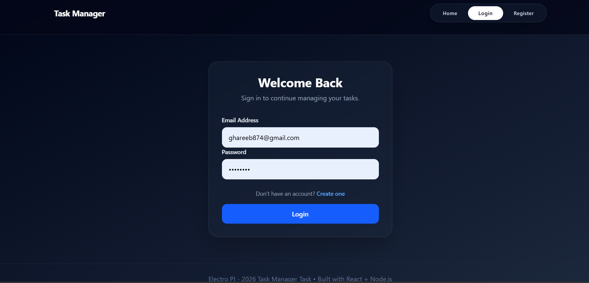
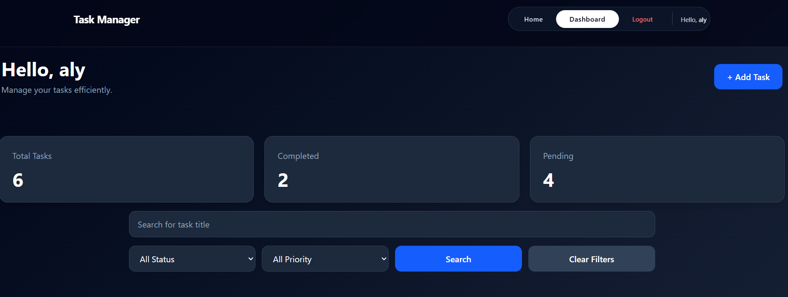
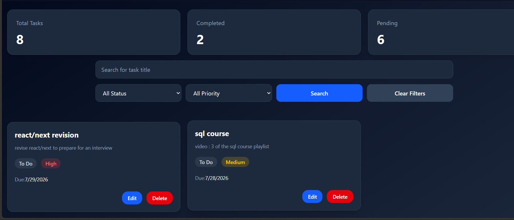

# Task Manager - MERN Stack Assessment

A full-stack Task Management application built using the **MERN Stack** (MongoDB, Express.js, React.js, Node.js). The application allows users to securely register, authenticate, and manage their own tasks through a responsive and modern interface.

---

# Screenshots

## Login



## Dashboard




# Features

## Authentication

- User Registration
- User Login
- JWT Authentication
- Protected Routes
- Get Current User

## Task Management

- Create Task
- Update Task
- Delete Task
- View All User Tasks
- View Single Task

## Task Query Features

- Search Tasks by Title
- Filter by Status
- Filter by Priority
- Pagination
- Sorting

## Frontend

- Responsive UI built with Tailwind CSS
- Login & Registration pages
- Protected Dashboard
- Task Creation & Editing Modal
- Search Bar
- Status Filter
- Priority Filter
- Pagination with configurable page size
- Loading States
- Error States
- Empty States
- Client-side Form Validation
- Authentication state managed using React Context API

---

# Tech Stack

### Frontend

- React.js
- React Router
- Axios
- Tailwind CSS
- React Context API

### Backend

- Node.js
- Express.js
- MongoDB Atlas
- Mongoose
- JWT Authentication
- bcrypt
- express-validator

---

# Project Structure

```
Task-Manager-Assignment
│
├── Backend
│   ├── src
│   │   ├── controllers
│   │   ├── middleware
│   │   ├── models
│   │   ├── routes
│   │   ├── utils
│   │   ├── validations
│   │   ├── app.js
│   │   └── server.js
│   │
│   ├── .env.example
│   ├── package.json
│   └── vercel.json
│
├── Frontend
│   ├── src
│   │   ├── assets
│   │   ├── components
│   │   ├── context
│   │   ├── layout
│   │   ├── pages
│   │   ├── App.jsx
│   │   └── main.jsx
│   │
│   ├── .env.example
│   ├── package.json
│   └── vite.config.js
│
├── README.md
└── .gitignore
```

---

# Project Structure Explanation

## Backend

- **controllers** – Business logic for authentication and task management.
- **models** – MongoDB schemas for Users and Tasks.
- **middleware** – Authentication middleware and request validation.
- **routes** – REST API endpoints.
- **validations** – Backend request validation rules.
- **utils** – Shared utilities including global error handling and JWT generation.

## Frontend

- **pages** – Application pages (Login, Register, Home, etc.).
- **components** – Reusable UI components.
- **context** – Authentication state management using React Context API.
- **layout** – Shared layout components.

---

# Prerequisites

- Node.js (v18 or later recommended)
- npm
- MongoDB Atlas account (or local MongoDB)

---

# Installation

Clone the repository

```bash
git clone https://github.com/alighareeb01/Task-Manager-Assignment.git
```

Navigate into the project

```bash
cd Task-Manager-Assignment
```

---

# Backend Setup

Navigate to the backend

```bash
cd Backend
```

Install dependencies

```bash
npm install
```

Create a `.env` file using `.env.example`

Example

```env
PORT=5000
NODE_ENV=development

DATABASE=your_mongodb_connection_string

JWT_SECRET=your_secret_key
JWT_EXPIRES_IN=30d
```

Run the backend

```bash
npm run start:dev
```

---

# Frontend Setup

Navigate to the frontend

```bash
cd Frontend
```

Install dependencies

```bash
npm install
```

Create a `.env` file using `.env.example`

Example

```env
VITE_API_URL=http://localhost:5000/
```

Run the frontend

```bash
npm run dev
```

---

# Environment Variables

## Backend (.env)

```env
PORT=
NODE_ENV=

DATABASE=

JWT_SECRET=
JWT_EXPIRES_IN=
```

## Frontend (.env)

```env
VITE_API_URL=
```

---

# Main API Endpoints

## Authentication

### Register

```
POST /api/auth/register
```

### Login

```
POST /api/auth/login
```

### Get Current User

```
GET /api/auth/me
```

Requires

```
Authorization: Bearer <JWT_TOKEN>
```

---

## Tasks

### Create Task

```
POST /api/tasks
```

### Get All Tasks

```
GET /api/tasks
```

Supports query parameters

| Parameter | Description        |
| --------- | ------------------ |
| search    | Search task title  |
| status    | Filter by status   |
| priority  | Filter by priority |
| page      | Pagination page    |
| limit     | Tasks per page     |
| sort      | Sort results       |

Examples

```
GET /api/tasks?status=Done

GET /api/tasks?priority=High

GET /api/tasks?search=meeting

GET /api/tasks?page=2&limit=5

GET /api/tasks?sort=-createdAt
```

### Get Single Task

```
GET /api/tasks/:id
```

### Update Task

```
PATCH /api/tasks/:id
```

### Delete Task

```
DELETE /api/tasks/:id
```

### Task Statistics

```
GET /api/tasks/stats
```

Returns

- Total Tasks
- Completed Tasks
- Pending Tasks

---

# Authentication

All protected endpoints require

```
Authorization: Bearer <JWT_TOKEN>
```

Each authenticated user can only access their own tasks.

---

# Completed Features

✅ User Registration

✅ User Login

✅ JWT Authentication

✅ Protected Routes

✅ Password Hashing using bcrypt

✅ Backend Validation

✅ Global Error Handling

✅ CRUD Operations

✅ Search by Title

✅ Filter by Status

✅ Filter by Priority

✅ Pagination

✅ Sorting

✅ Task Statistics

✅ Responsive UI

✅ Loading, Error and Empty States

✅ React Context Authentication

---

# Known Issues / Incomplete Items

The core assignment requirements have been completed.

Possible future improvements include:

- Refresh Token Authentication
- Password Reset
- Rate Limiting
- Docker Support
- Automated Unit & Integration Tests
- Drag-and-Drop Task Management
- Task Attachments
- API Documentation (Swagger/OpenAPI)

---

# Live Demo

Not deployed.

---

# Test Account

A reviewer can create a new account using

```
POST /api/auth/register
```

Or use a predefined account if available

```
Email:
reviewer@example.com

Password:
Reviewer123
```

_(Update these credentials before submission if you create a dedicated reviewer account.)_

---

# Development Notes

This project was developed independently as part of a MERN Stack technical assessment.

Resources used during development include:

- Official React Documentation
- Official Express.js Documentation
- MongoDB Documentation
- Mongoose Documentation
- JWT Documentation
- Tailwind CSS Documentation

AI tools (ChatGPT by OpenAI) were used as a productivity and learning assistant for:

- Debugging and troubleshooting
- Code review and refactoring
- React component organization
- Improving UI styling and responsive design
- General MERN development guidance
- Final project review before submission
- README preparation and documentation

All implementation decisions, architecture, and final code were reviewed, understood, and verified by the author.

---

# Author

**Aly Abdullkareem Ahmed**

GitHub

https://github.com/alighareeb01
